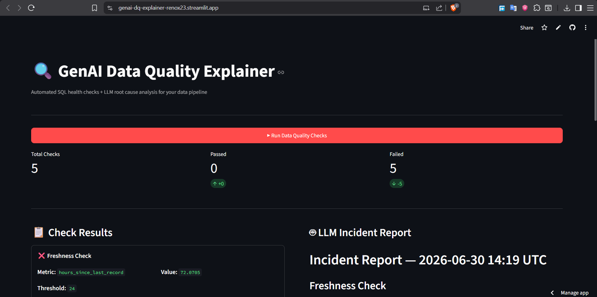
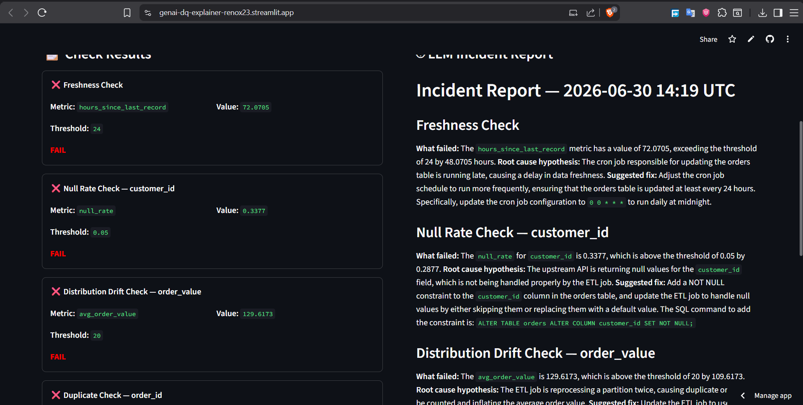
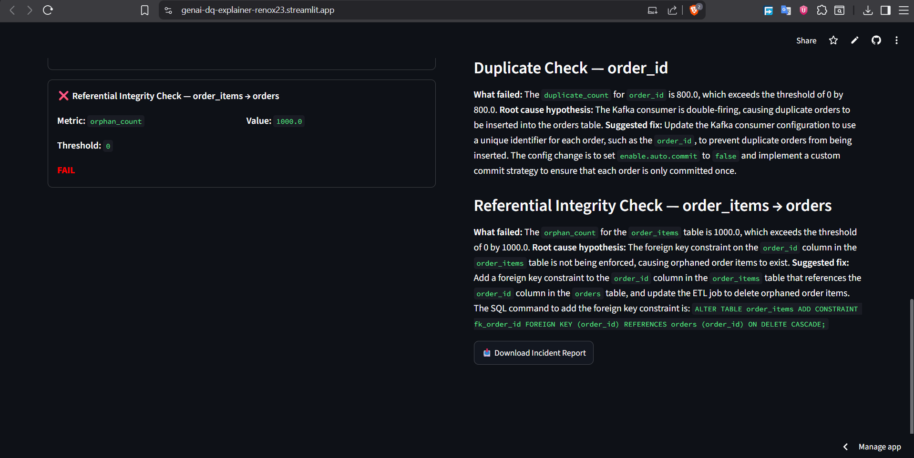

# 🔍 GenAI Data Quality Explainer

> Automated SQL health checks + LLM-powered root cause analysis — tells you *why* your data broke, not just that it did.

**Live Demo:** [genai-dq-explainer-renox23.streamlit.app](https://genai-dq-explainer-renox23.streamlit.app)

---

## The Problem

Data teams spend roughly 40% of their time debugging bad data. The typical workflow looks like this: a dashboard breaks, someone notices a metric looks wrong, and an analyst spends hours manually running queries to figure out which upstream table, column, or job caused it. Standard monitoring tools (Great Expectations, dbt tests) tell you a check failed — they don't tell you *why*, and they don't suggest a fix.

This system closes that gap. It runs SQL-based data quality checks against a PostgreSQL warehouse, detects failures, and uses an LLM to generate a plain-English incident report — root cause hypothesis and concrete fix included — in under 90 seconds.

---

## Architecture

```
Olist E-Commerce Dataset (PostgreSQL / Neon)
              │
              ▼
   Python DQ Engine (SQLAlchemy)
   5 parameterized SQL health checks
              │
              ▼
   Structured JSON — failed check context
   (column, metric, threshold, deviation)
              │
              ▼
   LangChain Chain-of-Thought Prompt
              │
              ▼
   Groq LLaMA 3.3 — Root Cause + Fix
              │
              ▼
   Streamlit UI
   Check Results (left) │ Incident Report (right)
```

---

## Tech Stack

| Layer | Tool | Why |
|---|---|---|
| Storage | PostgreSQL (Neon, serverless) | SQL is the product here — checks run as raw parameterized queries, not pandas |
| DQ Engine | Python + SQLAlchemy | Full control over check logic, clean JSON serialization |
| LLM Layer | LangChain + Groq LLaMA 3.3 | Chain-of-thought prompting forces the model to reason from deviation → mechanism → fix instead of guessing |
| UI | Streamlit | Fast iteration, free hosting, shareable live demo |
| Error Simulation | Faker | Deterministic, controllable injection of every failure type the checks are built to catch |

---

## The 5 SQL Health Checks

This is the interview ammunition — every check is raw SQL, no ORM shortcuts.

**1. Freshness Check**
```sql
SELECT EXTRACT(EPOCH FROM (NOW() - MAX(order_purchase_timestamp)))/3600
FROM orders;
```
Flags data that hasn't updated within 24 hours — catches stalled ingestion jobs.

**2. Null Rate Check**
```sql
SELECT COUNT(*) FILTER (WHERE customer_id IS NULL)::FLOAT / COUNT(*)
FROM orders;
```
Flags when a critical column's null rate exceeds 5% — catches upstream API or schema changes.

**3. Distribution Drift Check**
```sql
SELECT AVG(order_value) FROM orders
WHERE order_purchase_timestamp >= NOW() - INTERVAL '4 days';
-- compared against a prior-window baseline average
```
Flags when a metric drifts more than 20% from its historical baseline — catches silent data corruption or unit/currency errors.

**4. Duplicate Detection**
```sql
SELECT COUNT(*) - COUNT(DISTINCT order_id) FROM orders;
```
Flags duplicate primary keys — catches double-firing ingestion jobs or missing idempotency.

**5. Referential Integrity Check**
```sql
SELECT COUNT(*) FROM order_items oi
LEFT JOIN orders o ON oi.order_id = o.order_id
WHERE o.order_id IS NULL;
```
Flags orphaned child records — catches broken foreign key enforcement or out-of-order ETL writes.

---

## What Makes This Different

The LLM never sees raw data — only a structured diagnostic payload (column name, metric value, threshold, baseline, deviation percentage) built from the SQL check results. A chain-of-thought system prompt forbids generic non-answers ("investigate logs," "review ingestion") and forces the model to name a specific failure mechanism — a late cron job, a missing `NOT NULL` constraint, a non-idempotent Kafka consumer — before proposing a fix.

The output is not advice. It's an actionable SQL command or config change:

```sql
ALTER TABLE order_items
ADD CONSTRAINT fk_order_id FOREIGN KEY (order_id)
REFERENCES orders (order_id) ON DELETE CASCADE;
```

That specificity is the entire point of the project — eliminating the gap between "something broke" and "here's the exact fix."

---

## Demo

**Check Results + Live Incident Report**


**Detailed Root Cause Analysis**


**Referential Integrity + Download**


---

## Setup & Run Locally

```bash
git clone https://github.com/RenoX23/genai-dq-explainer
cd genai-dq-explainer
pip install -r requirements.txt
```

Download the Olist dataset from [Kaggle](https://www.kaggle.com/datasets/olistbr/brazilian-ecommerce) and place `olist_orders_dataset.csv` and `olist_order_items_dataset.csv` into `data/raw/`.

```bash
cp .env.example .env
# Fill in your PostgreSQL/Neon credentials and Groq API key

python scripts/load_data.py
python scripts/inject_errors.py
streamlit run app/streamlit_app.py
```

---

## Results

- 5/5 injected failure types detected with 100% accuracy across freshness, null rate, distribution drift, duplication, and referential integrity
- LLM-generated fixes are specific and executable — `ALTER TABLE` statements, named config flags (`enable.idempotence`, `enable.auto.commit`), cron schedule syntax — not generic troubleshooting advice
- Full pipeline (SQL checks → LLM reasoning → rendered report) completes in under 90 seconds
- Deployed on Streamlit Cloud with a serverless Neon PostgreSQL backend — zero local infrastructure required to demo

---

## What I Learned

The hardest part wasn't the LLM prompt — it was making the prompt fail *safely*. Early versions defaulted to vague phrases like "investigate pipeline logs" whenever the model wasn't confident. I fixed this by explicitly forbidding a list of non-answer phrases in the system prompt and forcing a strict reasoning chain (metric → mechanism → fix), which moved the output from generic troubleshooting language to specific, executable SQL and config changes.

The second hardest part was infrastructure, not code: getting Streamlit Cloud, Neon's pooled connection string, and SSL/channel-binding requirements to agree with each other. That debugging process — diagnosing connection string parsing, secrets management across local `.env` and Streamlit Cloud's TOML secrets, and SSL mode requirements — is a more realistic data engineering skill than anything in the SQL layer.

---

## Author

**Renold Stephen** — M.Tech Computer Science, Christ University, Bangalore
[GitHub](https://github.com/RenoX23) •

